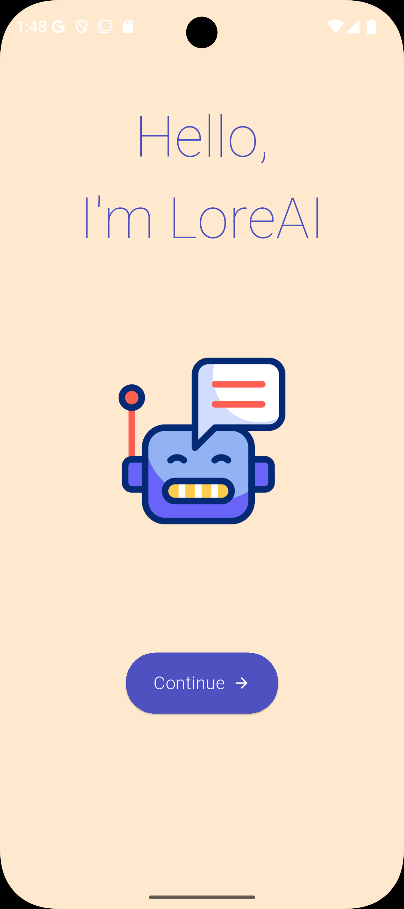
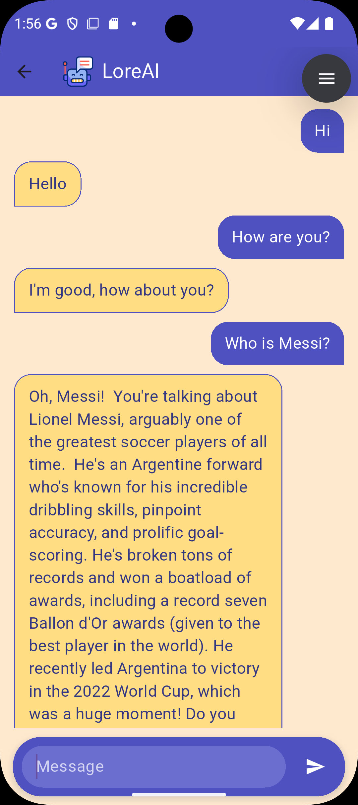
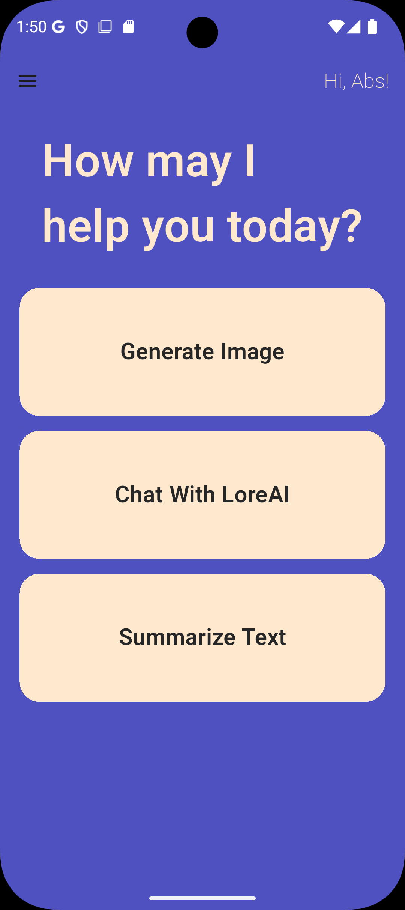

# LoreAI 🧠🎨📝

LoreAI is a multi-functional Flutter application that harnesses the power of Google's **Gemini AI** to deliver intelligent features including chatbot interaction, image generation, and text summarization — all in one seamless mobile experience.

<p align="center">
  
  
  
  
</p>

---

## ✨ Features

- 🤖 **Chat with Bot**  
  Talk to an intelligent AI-powered chatbot that understands and responds naturally using Gemini.

- 🎨 **Image Generation**  
  Describe any idea and see it turned into AI-generated images.

- 📝 **Text Summarization**  
  Paste or type in long texts and get concise summaries instantly.

---

## 🚀 Tech Stack

- **Flutter** – Cross-platform mobile development
- **Dart** – Application programming
- **Gemini API** – AI services (Chat, Vision, Text Summary)

---

## 📷 Screenshots

Screenshots are available in the `screenshots/` directory:
- `ss_1.png` – App Home Screen  
- `ss_2.png` – Chat with Bot  
- `ss_3.png` – Image Generator  
- `ss_4.png` – Text Summarization  

---

## 🛠️ Installation

1. **Clone the repository:**
   ```bash
   git clone https://github.com/Abs-Futy7/LoreAI.git
   cd LoreAI
2. **Get the dependencies:**

```flutter pub get```

3. **Run the app:**

    ```flutter run```

###💡 Make sure to add your Gemini API key in the appropriate config file before running.
